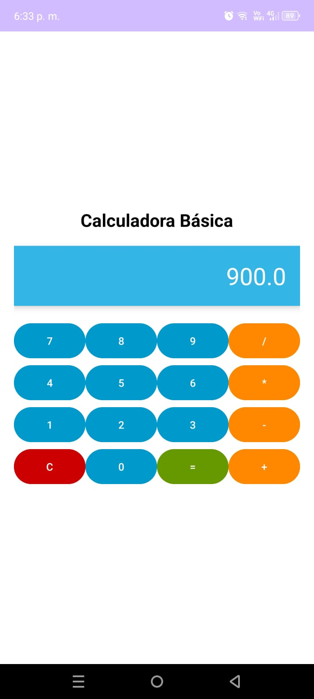

# Calculadora Básica

Nuestra calculadora básica permite realizar operaciones aritméticas simples como suma, resta, multiplicación y división. La aplicación tiene una interfaz intuitiva y funcional, que permite a los usuarios ingresar números y operar fácilmente.

## Características principales
- Interfaz sencilla y fácil de usar.
- Operaciones (suma, resta, multiplicación y división).
- Diseñado para dispositivos Android.

## Capturas de pantalla

  
  
  
  

## Instalación
Puedes descargar el archivo APK desde el siguiente enlace:
[Descargar APK](https://drive.google.com/file/d/1h5-bJarA0R__hGiGW0ucFCoB4wTTAurB/view?usp=sharing)

## Contacto
Si tienes dudas o sugerencias, no dudes en contactarme en [barreraha@itecsur.edu.ec](barreraha@itecsur.edu.ec) o abrir un issue en este repositorio.
